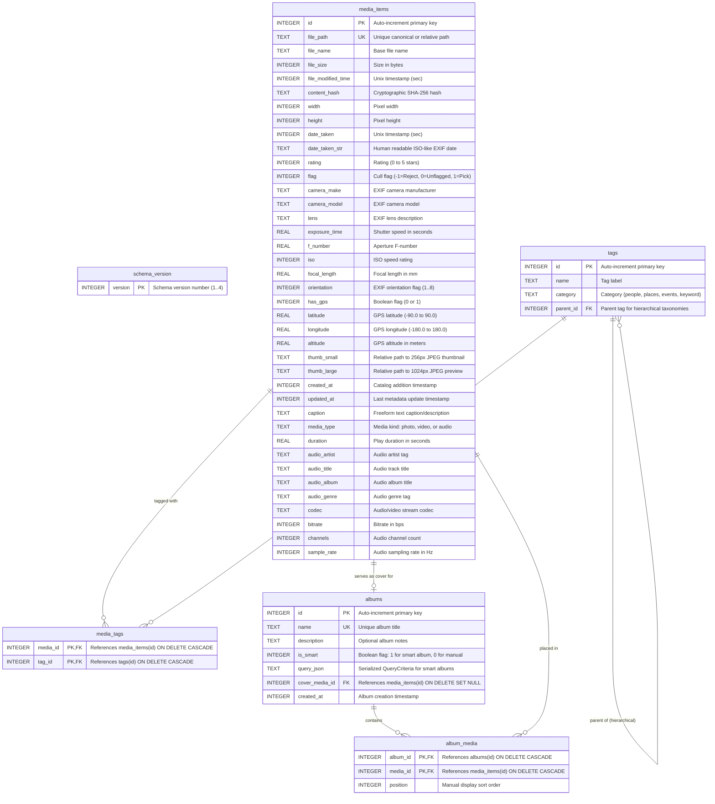
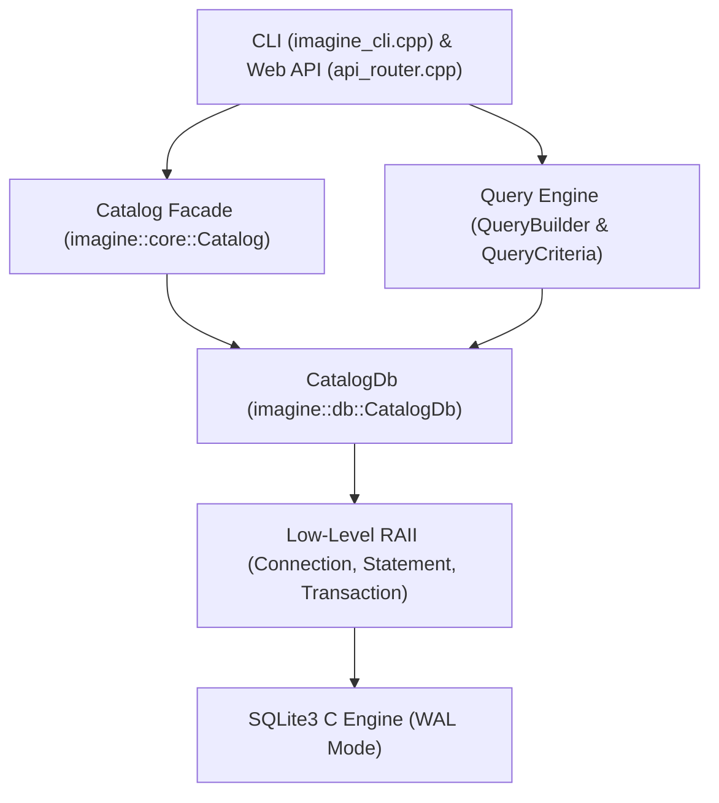

# Database Schema & Data Layer — Developer Documentation

This document provides a comprehensive technical reference for the **Imagine** database schema, storage engine configuration, migration system, index strategies, and C++ data access layer.

---

## 1. Storage Engine Architecture & SQLite Pragmas

Imagine utilizes an embedded **SQLite 3** relational database engine managed via custom C++20 RAII wrappers. The database file defaults to `catalog.db` in the working directory (configurable via `--catalog <path>`) or `:memory:` during automated unit and integration tests.

### Engine Configuration & Pragmas

When a database connection is opened in [`Connection::open`](file:///C:/Users/slava/source/repos/imagine/src/db/connection.cpp#L144-L171), SQLite is configured with specific runtime PRAGMAs to optimize concurrency, throughput, and relational integrity:

| PRAGMA | Value | Rationale & Architectural Impact |
|---|---|---|
| `journal_mode` | `WAL` | **Write-Ahead Logging** enables concurrent readers without locking during write transactions. Readers do not block writers, and writers do not block readers. |
| `synchronous` | `NORMAL` | In WAL mode, `NORMAL` ensures ACID safety while syncing the WAL file only at checkpoints, drastically reducing disk I/O latency during bulk imports. |
| `foreign_keys` | `ON` | Enforces relational constraints (such as `ON DELETE CASCADE` and `ON DELETE SET NULL`) at the SQLite engine level. |
| `temp_store` | `MEMORY` | Directs SQLite temporary tables, scratch indices, and sorting buffers to RAM rather than disk. |
| `cache_size` | `-64000` | Allocates a 64 MB page cache in memory (negative values specify size in kibibytes), accelerating frequent index and timeline lookups. |

### Thread Safety & Concurrency Model

- SQLite connection flags: `SQLITE_OPEN_READWRITE | SQLITE_OPEN_CREATE | SQLITE_OPEN_FULLMUTEX`.
- In C++, all public member functions in [`CatalogDb`](file:///C:/Users/slava/source/repos/imagine/include/imagine/db/catalog_db.hpp#L15-L86) synchronize access via an internal `std::recursive_mutex mutex_`.
- Combined with SQLite WAL mode, this provides safe multi-threaded query execution across the HTTP thread pool and background importer pipelines.

---

## 2. Entity-Relationship Diagram (ERD)



---

## 3. Detailed Table Specifications

### 3.1 `schema_version`

Stores the applied database migration version level.

| Column | SQLite Type | Constraints | C++ Type | Description |
|---|---|---|---|---|
| `version` | `INTEGER` | `PRIMARY KEY` | `int` | Integer migration counter (`1`, `2`, `3`, `4`). The maximum value represents the current database schema version. |

---

### 3.2 `media_items`

The central catalog table containing all imported media assets (photos, videos, audio), cryptographic hash signatures, EXIF camera metadata, ratings, cull flags, geotags, and cached thumbnail paths.

| # | Column | SQLite Type | Constraints | C++ Mapping | Description |
|---|---|---|---|---|---|
| 1 | `id` | `INTEGER` | `PRIMARY KEY AUTOINCREMENT` | `MediaId` (`int64_t`) | Unique media record identifier. |
| 2 | `file_path` | `TEXT` | `UNIQUE NOT NULL` | `std::string` | Absolute or catalog-relative path to original file on disk. |
| 3 | `file_name` | `TEXT` | `NOT NULL` | `std::string` | Base file name including extension (e.g., `mountain.jpg`). |
| 4 | `file_size` | `INTEGER` | `NOT NULL` | `int64_t` | File size in bytes. |
| 5 | `file_modified_time` | `INTEGER` | `NOT NULL` | `int64_t` | Filesystem modification time (Unix epoch in seconds). |
| 6 | `content_hash` | `TEXT` | `NOT NULL` | `std::string` | Hex-encoded cryptographic SHA-256 content hash for deduplication. |
| 7 | `width` | `INTEGER` | `DEFAULT 0` | `int32_t` | Pixel width (0 if audio or unavailable). |
| 8 | `height` | `INTEGER` | `DEFAULT 0` | `int32_t` | Pixel height (0 if audio or unavailable). |
| 9 | `date_taken` | `INTEGER` | `NOT NULL` | `int64_t` | Capture date / timestamp (Unix epoch in seconds). Falls back to modification time if absent. |
| 10 | `date_taken_str` | `TEXT` | `DEFAULT ''` | `std::string` | Original ISO-8601 or EXIF format date string (`YYYY:MM:DD HH:MM:SS`). |
| 11 | `rating` | `INTEGER` | `DEFAULT 0` | `int32_t` | User star rating: `0` (unrated) to `5` (five stars). |
| 12 | `flag` | `INTEGER` | `DEFAULT 0` | `FlagState` (`int8_t`) | Cull flag: `-1` (Reject), `0` (Unflagged), `1` (Pick). |
| 13 | `camera_make` | `TEXT` | `DEFAULT ''` | `std::string` | EXIF camera manufacturer (e.g., `Sony`, `Canon`, `Apple`). |
| 14 | `camera_model` | `TEXT` | `DEFAULT ''` | `std::string` | EXIF camera model (e.g., `ILCE-7M4`, `EOS R5`). |
| 15 | `lens` | `TEXT` | `DEFAULT ''` | `std::string` | Lens model description (e.g., `FE 24-70mm F2.8 GM II`). |
| 16 | `exposure_time` | `REAL` | `DEFAULT 0.0` | `double` | Shutter exposure duration in seconds (e.g., `0.004` for 1/250s). |
| 17 | `f_number` | `REAL` | `DEFAULT 0.0` | `double` | Lens aperture value (e.g., `2.8`). |
| 18 | `iso` | `INTEGER` | `DEFAULT 0` | `int32_t` | ISO sensitivity setting (e.g., `100`, `3200`). |
| 19 | `focal_length` | `REAL` | `DEFAULT 0.0` | `double` | Lens focal length in millimeters (e.g., `50.0`). |
| 20 | `orientation` | `INTEGER` | `DEFAULT 1` | `int32_t` | Standard EXIF orientation tag value (`1` to `8`). |
| 21 | `has_gps` | `INTEGER` | `DEFAULT 0` | `bool` | Flag indicating whether valid geographic coordinates exist (`1` = yes, `0` = no). |
| 22 | `latitude` | `REAL` | `DEFAULT 0.0` | `double` | WGS-84 latitude in decimal degrees (`-90.0` to `90.0`). |
| 23 | `longitude` | `REAL` | `DEFAULT 0.0` | `double` | WGS-84 longitude in decimal degrees (`-180.0` to `180.0`). |
| 24 | `altitude` | `REAL` | `DEFAULT 0.0` | `double` | Altitude in meters above sea level. |
| 25 | `thumb_small` | `TEXT` | `DEFAULT ''` | `std::string` | Relative path to 256px small thumbnail in cache (e.g., `34/2a/342a..._256.jpg`). |
| 26 | `thumb_large` | `TEXT` | `DEFAULT ''` | `std::string` | Relative path to 1024px preview in cache (e.g., `34/2a/342a..._1024.jpg`). |
| 27 | `created_at` | `INTEGER` | `NOT NULL` | `int64_t` | Timestamp when record was added to catalog (Unix epoch in seconds). |
| 28 | `updated_at` | `INTEGER` | `NOT NULL` | `int64_t` | Timestamp when record metadata was last altered (Unix epoch in seconds). |
| 29 | `caption` | `TEXT` | `DEFAULT ''` | `std::string` | User-defined or IPTC/XMP caption / notes (added in migration v2). |
| 30 | `media_type` | `TEXT` | `DEFAULT 'photo'` | `std::string` | Asset classification: `'photo'`, `'video'`, or `'audio'` (added in migration v3). |
| 31 | `duration` | `REAL` | `DEFAULT 0.0` | `double` | Total playback duration in seconds (added in migration v3). |
| 32 | `audio_artist` | `TEXT` | `DEFAULT ''` | `std::string` | ID3 / Vorbis audio artist tag (added in migration v3). |
| 33 | `audio_title` | `TEXT` | `DEFAULT ''` | `std::string` | ID3 / Vorbis audio title tag (added in migration v3). |
| 34 | `audio_album` | `TEXT` | `DEFAULT ''` | `std::string` | ID3 / Vorbis audio album tag (added in migration v3). |
| 35 | `audio_genre` | `TEXT` | `DEFAULT ''` | `std::string` | ID3 / Vorbis audio genre tag (added in migration v3). |
| 36 | `codec` | `TEXT` | `DEFAULT ''` | `std::string` | Audio/video format codec identifier (added in migration v3). |
| 37 | `bitrate` | `INTEGER` | `DEFAULT 0` | `int32_t` | Stream bitrate in bits per second (added in migration v3). |
| 38 | `channels` | `INTEGER` | `DEFAULT 0` | `int32_t` | Audio channel count (e.g., 1=mono, 2=stereo) (added in migration v3). |
| 39 | `sample_rate` | `INTEGER` | `DEFAULT 0` | `int32_t` | Audio sampling frequency in Hertz (e.g., 44100, 48000) (added in migration v3). |

---

### 3.3 `tags`

Stores organizational tags arranged into categories (`people`, `places`, `events`, `keyword`) and supports hierarchical nesting via self-referential foreign keys.

| Column | SQLite Type | Constraints | C++ Mapping | Description |
|---|---|---|---|---|
| `id` | `INTEGER` | `PRIMARY KEY AUTOINCREMENT` | `TagId` (`int64_t`) | Unique tag identifier. |
| `name` | `TEXT` | `NOT NULL` | `std::string` | Tag display name (e.g., `Paris`, `Alice`, `Vacation 2026`). |
| `category` | `TEXT` | `NOT NULL DEFAULT 'keyword'` | `std::string` | Category grouping: `'keyword'`, `'people'`, `'places'`, or `'events'`. |
| `parent_id` | `INTEGER` | `REFERENCES tags(id) ON DELETE SET NULL` | `std::optional<TagId>` | Optional parent tag ID for nested tag taxonomies. |

- **Compound Constraint**: `UNIQUE(name, category)` ensures that tag names are unique within each category.

---

### 3.4 `media_tags`

Junction table implementing many-to-many relationships between `media_items` and `tags`.

| Column | SQLite Type | Constraints | C++ Mapping | Description |
|---|---|---|---|---|
| `media_id` | `INTEGER` | `NOT NULL REFERENCES media_items(id) ON DELETE CASCADE` | `MediaId` (`int64_t`) | Targeted media item ID. |
| `tag_id` | `INTEGER` | `NOT NULL REFERENCES tags(id) ON DELETE CASCADE` | `TagId` (`int64_t`) | Attached tag ID. |

- **Compound Primary Key**: `PRIMARY KEY(media_id, tag_id)` prevents duplicate tag assignments to the same item.
- **Cascading Deletion**: Deleting a photo automatically detaches its tags; deleting a tag unlinks it from all media without deleting the media items.

---

### 3.5 `albums`

Stores manual collections and dynamic "smart" albums.

| Column | SQLite Type | Constraints | C++ Mapping | Description |
|---|---|---|---|---|
| `id` | `INTEGER` | `PRIMARY KEY AUTOINCREMENT` | `AlbumId` (`int64_t`) | Unique album identifier. |
| `name` | `TEXT` | `NOT NULL UNIQUE` | `std::string` | Unique album title. |
| `description` | `TEXT` | `DEFAULT ''` | `std::string` | Optional markdown or text description. |
| `is_smart` | `INTEGER` | `DEFAULT 0` | `bool` | `1` if this is a smart query-based album, `0` for manual collection. |
| `query_json` | `TEXT` | `DEFAULT ''` | `std::string` | Serialized JSON representation of [`QueryCriteria`](file:///C:/Users/slava/source/repos/imagine/include/imagine/core/query.hpp#L15-L41) executed dynamically for smart albums. |
| `cover_media_id` | `INTEGER` | `REFERENCES media_items(id) ON DELETE SET NULL` | `std::optional<MediaId>` | ID of the photo selected as the album cover preview. |
| `created_at` | `INTEGER` | `NOT NULL` | `int64_t` | Unix epoch creation timestamp. |

---

### 3.6 `album_media`

Junction table maintaining ordered membership of media items within manual albums.

| Column | SQLite Type | Constraints | C++ Mapping | Description |
|---|---|---|---|---|
| `album_id` | `INTEGER` | `NOT NULL REFERENCES albums(id) ON DELETE CASCADE` | `AlbumId` (`int64_t`) | Target album ID. |
| `media_id` | `INTEGER` | `NOT NULL REFERENCES media_items(id) ON DELETE CASCADE` | `MediaId` (`int64_t`) | Assigned media item ID. |
| `position` | `INTEGER` | `DEFAULT 0` | `int` | Custom zero-based user arrangement index for custom ordering. |

- **Compound Primary Key**: `PRIMARY KEY(album_id, media_id)` prevents duplicate insertions into an album.
- **Ordering**: Queries fetch items sorted by `album_media.position ASC, media_items.date_taken DESC`.

---

## 4. Comprehensive Index Catalog

The database includes specialized B-Tree indices designed to ensure sub-millisecond query latency across millions of assets:

| Index Name | Table | Indexed Columns | Index Type | Query Optimization Purpose |
|---|---|---|---|---|
| `sqlite_autoindex_media_items_1` | `media_items` | `file_path` | Implicit Unique | Enforces path uniqueness and powers fast exact-path lookup in [`getMediaByPath`](file:///C:/Users/slava/source/repos/imagine/src/db/catalog_db.cpp#L480-L492). |
| `idx_media_hash` | `media_items` | `content_hash` | Secondary B-Tree | Powers instant deduplication checks during importer scans in [`getMediaByHash`](file:///C:/Users/slava/source/repos/imagine/src/db/catalog_db.cpp#L493-L504). |
| `idx_media_date` | `media_items` | `date_taken DESC` | Secondary B-Tree (Descending) | Optimizes default chronological media grid rendering and timeline histogram grouping queries. |
| `idx_media_rating` | `media_items` | `rating` | Secondary B-Tree | Speeds up star-rating culling filters (`rating >= ?`, unrated filters). |
| `idx_media_flag` | `media_items` | `flag` | Secondary B-Tree | Accelerates quick-filter queries for Picks (`flag = 1`), Rejects (`flag = -1`), and non-rejects. |
| `idx_media_camera` | `media_items` | `camera_make, camera_model` | Composite B-Tree | Speeds up multi-camera filtering and metadata search matching equipment models. |
| `idx_media_caption` | `media_items` | `caption` | Secondary B-Tree | Added in v2. Accelerates caption-specific search and text filtering. |
| `idx_media_type` | `media_items` | `media_type` | Secondary B-Tree | Added in v3. Optimizes type filtering (photos vs. videos vs. audio tracks). |
| `sqlite_autoindex_tags_1` | `tags` | `name, category` | Implicit Unique | Enforces uniqueness per category and powers [`createOrGetTag`](file:///C:/Users/slava/source/repos/imagine/src/db/catalog_db.cpp#L600-L623). |
| `idx_tags_category` | `tags` | `category` | Secondary B-Tree | Speeds up sidebar tag listing grouped by `category` (people, places, events, keywords). |
| `sqlite_autoindex_media_tags_1` | `media_tags` | `media_id, tag_id` | Implicit Primary Key | Speeds up forward lookups (fetching all tags for a given media item or batch). |
| `idx_media_tags_tag` | `media_tags` | `tag_id` | Secondary B-Tree | Enables efficient reverse lookups (finding all media items with a specific tag). |
| `sqlite_autoindex_albums_1` | `albums` | `name` | Implicit Unique | Enforces unique album titles and powers name lookups. |
| `sqlite_autoindex_album_media_1` | `album_media` | `album_id, media_id` | Implicit Primary Key | Accelerates album membership lookups and updates. |
| `idx_album_media_media` | `album_media` | `media_id` | Secondary B-Tree | Enables efficient reverse lookups (determining which albums contain a given photo). |

---

## 5. Schema Migrations Architecture

Database migrations are managed programmatically in [`include/imagine/db/schema.hpp`](file:///C:/Users/slava/source/repos/imagine/include/imagine/db/schema.hpp) and [`src/db/schema.cpp`](file:///C:/Users/slava/source/repos/imagine/src/db/schema.cpp).

### Migration Runner Lifecycle

When [`CatalogDb::open`](file:///C:/Users/slava/source/repos/imagine/src/db/catalog_db.cpp#L20-L25) is called:
1. It opens the database file and configures SQLite PRAGMAs.
2. It invokes [`Schema::migrate(conn)`](file:///C:/Users/slava/source/repos/imagine/src/db/schema.cpp#L214-L248).
3. [`Schema::getCurrentVersion`](file:///C:/Users/slava/source/repos/imagine/src/db/schema.cpp#L6-L22) queries `SELECT MAX(version) FROM schema_version`. If `schema_version` does not exist, it creates the table and returns `0`.
4. Sequentially executes any unapplied migration methods (`applyMigrationV1`, `applyMigrationV2`, etc.) inside individual atomic [`Transaction`](file:///C:/Users/slava/source/repos/imagine/include/imagine/db/connection.hpp#L94-L108) blocks.
5. Inserts the newly achieved version number into `schema_version` and commits.

### Migration History

#### Version 1 (Baseline)
- Creates base tables: `media_items`, `tags`, `media_tags`, `albums`, `album_media`.
- Creates core B-Tree indices: `idx_media_hash`, `idx_media_date`, `idx_media_rating`, `idx_media_flag`, `idx_media_camera`, `idx_tags_category`, `idx_media_tags_tag`, `idx_album_media_media`.
- Records version `1` in `schema_version`.

#### Version 2 (Captions)
- Executes:
  ```sql
  ALTER TABLE media_items ADD COLUMN caption TEXT DEFAULT '';
  CREATE INDEX IF NOT EXISTS idx_media_caption ON media_items(caption);
  ```
- Records version `2` in `schema_version`.

#### Version 3 (Audio & Video Formats)
- Expands `media_items` to support multimedia cataloging (videos, audio recordings):
  ```sql
  ALTER TABLE media_items ADD COLUMN media_type TEXT DEFAULT 'photo';
  ALTER TABLE media_items ADD COLUMN duration REAL DEFAULT 0.0;
  ALTER TABLE media_items ADD COLUMN audio_artist TEXT DEFAULT '';
  ALTER TABLE media_items ADD COLUMN audio_title TEXT DEFAULT '';
  ALTER TABLE media_items ADD COLUMN audio_album TEXT DEFAULT '';
  ALTER TABLE media_items ADD COLUMN audio_genre TEXT DEFAULT '';
  ALTER TABLE media_items ADD COLUMN codec TEXT DEFAULT '';
  ALTER TABLE media_items ADD COLUMN bitrate INTEGER DEFAULT 0;
  ALTER TABLE media_items ADD COLUMN channels INTEGER DEFAULT 0;
  ALTER TABLE media_items ADD COLUMN sample_rate INTEGER DEFAULT 0;
  CREATE INDEX IF NOT EXISTS idx_media_type ON media_items(media_type);
  ```
- Records version `3` in `schema_version`.

#### Version 4 (Data Backfill for Media Types & Thumbnails)
- Performs data migration to classify legacy imports:
  - Detects video extensions (`.mp4`, `.mov`, `.avi`, `.mkv`, `.webm`, `.m4v`, `.mts`, `.m2ts`, `.m2t`, `.mpg`, `.mpeg`, `.wmv`, `.flv`, `.3gp`) and updates `media_type = 'video'`.
  - Detects audio extensions (`.mp3`, `.wav`, `.flac`, `.ogg`, `.m4a`, `.aac`, `.wma`) and updates `media_type = 'audio'`.
  - Generates standardized hash-based thumbnail paths (`substr(content_hash, 1, 2) || '/' || substr(content_hash, 3, 2) || '/' || content_hash || '_256.jpg'` and `_1024.jpg`) for video and audio entries with missing thumbnail paths.
- Records version `4` in `schema_version`.

### Adding a New Migration: Developer Checklist

1. **Increment Version Constant**: Update `static constexpr int CurrentVersion = N;` in [`include/imagine/db/schema.hpp`](file:///C:/Users/slava/source/repos/imagine/include/imagine/db/schema.hpp#L10).
2. **Declare Migration Method**: Add `static Status applyMigrationVN(Connection& conn);` under `private:` in [`include/imagine/db/schema.hpp`](file:///C:/Users/slava/source/repos/imagine/include/imagine/db/schema.hpp).
3. **Implement Migration**:
   - In [`src/db/schema.cpp`](file:///C:/Users/slava/source/repos/imagine/src/db/schema.cpp), wrap SQL in `Transaction tx(conn);`.
   - Execute DDL/DML statements.
   - Insert `INSERT INTO schema_version (version) VALUES (N);`.
   - Return `tx.commit()`.
4. **Wire into `Schema::migrate`**: Add condition:
   ```cpp
   if (current < N) {
       IMAGINE_LOG_INFO("Applying database migration vN...");
       Status s = applyMigrationVN(conn);
       if (!s.isOk()) return s;
       current = N;
   }
   ```
5. **Update C++ Structs & Accessors**: Update [`MediaItem`](file:///C:/Users/slava/source/repos/imagine/include/imagine/common/types.hpp#L135-L164), `extractMediaItem`, `insertMedia`, and `updateMedia` if new columns were added.
6. **Add Unit Tests**: Add test cases to [`tests/db_test.cpp`](file:///C:/Users/slava/source/repos/imagine/tests/db_test.cpp) verifying migration from existing database state.

---

## 6. C++ Data Access Architecture

The database subsystem uses a clean layered architecture separating low-level SQLite C-API calls from domain models and query construction:



### Key Classes

- [`Connection`](file:///C:/Users/slava/source/repos/imagine/include/imagine/db/connection.hpp#L66-L92): RAII wrapper around `sqlite3*`. Handles connection lifecycle, PRAGMA execution, and prepared statement compilation.
- [`Statement`](file:///C:/Users/slava/source/repos/imagine/include/imagine/db/connection.hpp#L21-L64): RAII wrapper around `sqlite3_stmt*`. Handles 1-indexed typed parameter binding (`bind(int, int64_t)`, `bind(int, const std::string&)`, `bindOptional`) and 0-indexed column extraction (`getInt64`, `getString`, `getDouble`, `isNull`).
- [`Transaction`](file:///C:/Users/slava/source/repos/imagine/include/imagine/db/connection.hpp#L94-L108): Automatic RAII transaction guard. Automatically rolls back via `ROLLBACK;` in destructor unless explicitly committed with `commit()`.
- [`CatalogDb`](file:///C:/Users/slava/source/repos/imagine/include/imagine/db/catalog_db.hpp#L15-L86): High-level, thread-safe data access object encapsulating all CRUD operations, batch operations, timeline histogram queries, and stats generation.
- [`QueryBuilder`](file:///C:/Users/slava/source/repos/imagine/include/imagine/core/query.hpp#L56-L99): Fluent query builder that dynamically constructs SQL `WHERE` and `ORDER BY` clauses and binds parameters to protect against SQL injection.

### Path Normalization & Portability (`makePathsRelative`)

To ensure catalogs can be moved between directories or machines without breaking media links, [`CatalogDb::makePathsRelative`](file:///C:/Users/slava/source/repos/imagine/src/db/catalog_db.cpp#L1148-L1284):
1. Accepts root `photosDir` and `thumbsDir`.
2. Computes canonical lexical relative paths using `std::filesystem::relative`.
3. Normalizes all path separators to POSIX forward slashes (`/`).
4. Updates `file_path`, `thumb_small`, and `thumb_large` in a single atomic transaction.

---

## 7. Verification & Automated Testing

The database layer and its schema migrations are covered by unit tests in [`tests/db_test.cpp`](file:///C:/Users/slava/source/repos/imagine/tests/db_test.cpp).

### Running Database Unit Tests

```bash
# Run all unit tests
./build/imagine_tests

# Run specifically database and connection tests
./build/imagine_tests --gtest_filter="*CatalogDb*:*Connection*:*Transaction*"
```

### Covered Test Areas
- In-memory database initialization and schema migration execution.
- Single and batch insertion, retrieval, updates, and deletion of media records.
- Tag creation, hierarchical tag retrieval (`parent_id`), duplicate handling, batch tag lookups, and unlinking.
- Album creation, cover image selection, manual media ordering (`position`), and cascade deletions.
- Aggregation queries: monthly timeline histogram (`getTimeline`) and catalog statistics (`getStats`).
- Geotag updates and clearance (`updateGps`).
- Path portability conversion (`makePathsRelative`).
- Low-level connection, statement binding, and transaction rollback / auto-rollback integrity.
