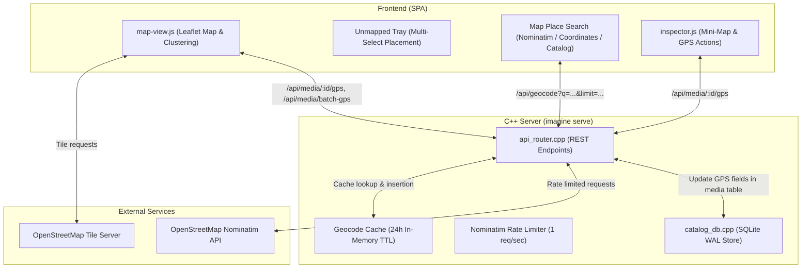

# Map View & Geotagging — Developer Documentation & REST API

This document provides technical architecture details, REST API specifications, and implementation guidelines for the **Map View & Geotagging** system in Imagine.

---

## 1. System Architecture

The Map View system consists of a browser-based Leaflet frontend, a high-performance C++20 REST backend, and an embedded SQLite database. It includes a rate-limited, cached geocoding proxy to interface with OpenStreetMap's Nominatim service.



---

## 2. REST API Reference (Map & GPS)

### 1. `POST /api/media/:id/gps`
Sets or clears GPS coordinates (latitude, longitude, altitude) for a single media item.

#### Request Headers
```http
Content-Type: application/json
```

#### Request Body
**Assigning GPS coordinates:**
```json
{
  "has_gps": true,
  "latitude": 48.8584,
  "longitude": 2.2945,
  "altitude": 35.0
}
```

**Clearing GPS coordinates:**
```json
{
  "has_gps": false
}
```

#### Parameter Constraints
- `latitude`: Required when `has_gps` is `true`. Floating point between `-90.0` and `90.0`.
- `longitude`: Required when `has_gps` is `true`. Floating point between `-180.0` and `180.0`.
- `altitude`: Optional floating point number in meters above sea level (defaults to `0.0`).

#### Success Response (`200 OK`)
```json
{
  "status": "ok",
  "id": 42,
  "has_gps": true,
  "latitude": 48.8584,
  "longitude": 2.2945,
  "altitude": 35.0
}
```

#### Error Responses
- `400 Bad Request`: Invalid coordinates, latitude out of range `[-90, 90]`, longitude out of range `[-180, 180]`, or malformed JSON.
- `404 Not Found`: Media ID does not exist in catalog database.

---

### 2. `POST /api/media/batch-gps`
Assigns or clears GPS coordinates for multiple media items in a single atomic database transaction.

#### Request Headers
```http
Content-Type: application/json
```

#### Request Body
```json
{
  "ids": [10, 11, 12, 15],
  "has_gps": true,
  "latitude": 37.7749,
  "longitude": -122.4194,
  "altitude": 0.0
}
```

#### Parameter Constraints
- `ids`: Non-empty array of integer media IDs (maximum batch size: `1,000` items).
- `has_gps`: Boolean indicating whether coordinates are being applied or cleared.
- `latitude`: Floating point between `-90.0` and `90.0` (validated when `has_gps` is `true`).
- `longitude`: Floating point between `-180.0` and `180.0` (validated when `has_gps` is `true`).

#### Success Response (`200 OK`)
```json
{
  "status": "ok",
  "updated_count": 4,
  "has_gps": true,
  "latitude": 37.7749,
  "longitude": -122.4194,
  "failed_ids": []
}
```

If some IDs do not exist, the server returns a partial status:
```json
{
  "status": "partial",
  "updated_count": 3,
  "has_gps": true,
  "latitude": 37.7749,
  "longitude": -122.4194,
  "failed_ids": [15]
}
```

---

### 3. `GET /api/geocode`
Geocoding search proxy that interfaces with OpenStreetMap's Nominatim service. Adheres strictly to Nominatim usage policies through rate-limiting, custom identification headers, and in-memory caching.

#### Query Parameters
| Parameter | Type | Required | Default | Description |
|---|---|---|---|---|
| `q` | `string` | **Yes** | — | Search query (e.g., place name, city, landmark, or address). |
| `limit` | `integer` | No | `5` | Maximum number of results to return (`1` to `10`). |

#### Example Request
```http
GET /api/geocode?q=Eiffel%20Tower&limit=3 HTTP/1.1
Host: localhost:8080
Accept: application/json
```

#### Success Response (`200 OK`)
```json
[
  {
    "place_id": 123456,
    "name": "Tour Eiffel",
    "display_name": "Tour Eiffel, 5, Avenue Anatole France, Quartier du Gros-Caillou, Paris 7e Arrondissement, Paris, Île-de-France, France",
    "lat": "48.8583736",
    "lon": "2.2944813",
    "type": "tower",
    "addresstype": "tourism"
  }
]
```

#### Implementation Characteristics
- **In-Memory Caching**: Responses are cached in `g_geocodeCache` for 24 hours keyed by `query|limit`. Identical requests return cached responses in `0ms` without external HTTP roundtrips.
- **Rate-Limiting**: A global mutex and timestamp tracker (`g_lastGeocodeRequestTime`) enforces a minimum `1,000ms` delay between outgoing Nominatim requests to respect upstream terms of service.
- **User-Agent**: Requests include `User-Agent: ImaginePhotoCatalog/1.0 (https://github.com/vblosh/imagine)`.

---

## 3. Frontend Architecture (`web/map-view.js`)

### Dynamic Spatial Clustering
Clustering groups nearby markers based on their projected screen distance:

```javascript
export function clusterGpsItems(gpsItems, map, radius = 50)
```
1. Converts geographic coordinates `[lat, lng]` to 2D pixel space at the current map zoom via `map.project([lat, lng], zoom)`.
2. Hashes projected points into spatial grid buckets of size `radius` pixels (`50px`).
3. Searches a 3×3 neighborhood of adjacent grid buckets to identify the closest existing cluster within `radius`.
4. Merges into existing cluster updating its center of mass, or instantiates a new cluster.
5. Re-evaluates clusters dynamically when the map triggers `zoomend` (debounced by 60ms).

### Interactive Map Popups
Clusters and individual pins generate interactive popup cards via `createMapPopupElement(items, initialItemId)`:
- Includes `<` / `>` cluster navigation buttons (`map-popup-nav`).
- Directly binds star rating handlers (`updateItemRating`) and flag toggles (`updateItemFlag`).
- Binds full-resolution preview transitions via `openLoupeForMedia(id)`.
- When unmapped photos are selected (in placement mode), displays a "Place Here" button (`.place-here-btn`) to assign the coordinates of the currently active photo in the bubble to the selected unmapped photo(s).

### Geotag Placement Mode State Machine
```
[Idle View]
    │
    │ Click Unmapped Chip / Inspector "Place on Map"
    ▼
[Placement Mode Active]  <── (map-view-container.placement-mode)
    │
    ├── Select All / Shift+Click / Ctrl+Click ──> Multi-Item Set
    │
    ├── Click Map Canvas ([lat, lng])
    │       │
    │       ▼
    │   applyGeotagBatch(ids, lat, lng)
    │       │
    │       ▼
    │   POST /api/media/batch-gps
    │       │
    │       ▼
    │
    ├── Click Pin Bubble "Place Here" ([bubble_lat, bubble_lng])
    │       │
    │       ▼
    │   applyGeotagBatch(ids, bubble_lat, bubble_lng)
    │       │
    │       ▼
    │   POST /api/media/batch-gps
    │       │
    │       ▼
    └── Exit Placement Mode & Invalidate GPS Cache
```

---

## 4. Key Source Code Files

| File | Purpose |
|---|---|
| [`web/map-view.js`](file:///C:/Users/slava/source/repos/imagine/web/map-view.js) | Leaflet map initialization, clustering, marker popups, unmapped tray, place search. |
| [`web/inspector.js`](file:///C:/Users/slava/source/repos/imagine/web/inspector.js) | Inspector mini-map preview, Show on Map, Clear GPS, and Place on Map triggers. |
| [`web/app.css`](file:///C:/Users/slava/source/repos/imagine/web/app.css) | Styles for `.custom-photo-pin`, `.map-popup-card`, `.unmapped-tray`, `.search-location-pin`. |
| [`src/server/api_router.cpp`](file:///C:/Users/slava/source/repos/imagine/src/server/api_router.cpp) | Handlers for `/api/media/:id/gps`, `/api/media/batch-gps`, and `/api/geocode`. |
| [`include/imagine/db/catalog_db.hpp`](file:///C:/Users/slava/source/repos/imagine/include/imagine/db/catalog_db.hpp) | SQLite database interface (`updateGps`, `getGpsMedia`). |
| [`tests/ui/test_map_view.py`](file:///C:/Users/slava/source/repos/imagine/tests/ui/test_map_view.py) | Comprehensive Playwright UI tests covering all map interactions. |

---

## 5. Automated Verification & Testing

The Map View is covered by automated deterministic Playwright UI tests:

```bash
# Run all UI tests including map view
pytest tests/ui/test_map_view.py -v

# Or use the test suite runner script
./tests/ui/run_ui_tests.sh
```

### Covered Test Cases
- `test_map_view_toggle`: View mode switching via toolbar buttons and keyboard shortcuts (`M` / `G`).
- `test_map_markers_and_popup`: Pin rendering, popup card contents, star rating, and Loupe view integration.
- `test_inspector_show_on_map`: Mini-map rendering and navigation sync between Inspector and Map.
- `test_geotag_placement_on_map`: Single photo click-to-place geotag assignment.
- `test_unmapped_tray_multi_select_and_batch_placement`: Multi-selection and batch placement via `/api/media/batch-gps`.
- `test_map_clustering_zoom_combine_and_decombine`: Zoom-dependent clustering and decombining.
- `test_geocode_backend_proxy_integration`: Location search via `/api/geocode` with place pinning and "Place Photo Here" flow.
- `test_unmapped_photo_hover_tooltip`: Hover metadata tooltip preview on unmapped photo chips.
- `test_map_bubble_place_here_for_unmapped_photo`: Assigning GPS of active photo in map bubble to selected unmapped photo(s).
