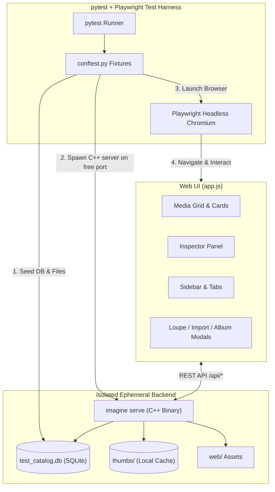

# Implementation Plan: Deterministic UI Tests for All Features

This plan outlines the architecture, implementation strategy, and verification steps for creating a comprehensive, deterministic End-to-End (E2E) UI testing suite for the **IMAGINE Photo Organizer Web UI** covering all user-facing features.

---

## Goal Description

The IMAGINE Web UI is a single-page application (`web/index.html`, `web/app.css`, `web/app.js`) designed for photo culling, catalog browsing, metadata inspection, tagging, album management, and batch operations.

To ensure long-term stability and eliminate regression risks, we will implement a fully automated, **deterministic UI test suite** covering 100% of the UI features. The tests will use **Playwright (Python) + pytest**, interacting directly with headless Chromium against ephemeral instances of the C++ `imagine serve` backend.

### What Makes These Tests Deterministic?
1. **Isolated Ephemeral Environments**: Each test run creates an isolated temporary directory containing a fresh SQLite catalog database (`catalog.db`) and thumbnail cache, completely eliminating test-order dependencies and disk state leakage.
2. **Seeded Test Fixtures**: Media records with known EXIF metadata, timestamps, flags, ratings, albums, and tags are pre-seeded into SQLite, guaranteeing identical inputs and expected outputs on every run.
3. **Dynamic Free-Port Allocation**: The `imagine serve` server process is bound to a dynamically detected free local port (`127.0.0.1:<port>`), preventing port collisions in parallel or multi-run executions.
4. **Zero Flaky Timeouts (`sleep`)**: Tests strictly use Playwright web-first assertions (`expect(locator).to_be_visible()`, `to_have_text(...)`, `to_have_class(...)`) with automatic retry polling instead of arbitrary `time.sleep` calls.
5. **Runtime Error Guards**: An active listener hooks `page.on("pageerror")` and `page.on("console")` to automatically fail tests if any unhandled JavaScript exceptions occur in `app.js`.

---

## User Review Required

> [!IMPORTANT]
> The test runner will use Python's `playwright` with headless Chromium. The Python environment already has `pytest` and `playwright` installed, and the headless Chromium binary is downloaded and validated on this system.

> [!NOTE]
> Tests will be placed in `tests/ui/`, accompanied by a turnkey runner script `tests/ui/run_ui_tests.sh` and integrated into CTest as `imagine_ui_tests` when tests are enabled.

---

## Architecture & Test Harness Design



---

## Proposed Changes

Grouping all changes by component:

### 1. Test Harness Infrastructure (`tests/ui/`)

#### [NEW] `tests/ui/requirements.txt`
Specifies python dependencies: `pytest>=8.0.0`, `playwright>=1.40.0`.

#### [NEW] `tests/ui/conftest.py`
Provides shared pytest fixtures:
- `imagine_bin`: Locates the compiled `build/imagine` executable (fails fast if not compiled).
- `test_env`: Context manager that creates a temporary directory with seeded test images (`nature`, `family`), builds a seeded SQLite catalog with predetermined records, and allocates an available TCP port.
- `backend_server`: Spawns `./build/imagine serve --catalog ... --thumbs ... --port ... --web-dir web`, polls `/api/stats` until the server reports ready, and guarantees process termination on fixture teardown.
- `page_with_errors`: Wraps Playwright `page` to record and assert zero console errors or uncaught JavaScript exceptions.

#### [NEW] `tests/ui/fixtures.py`
Helper utilities for programmatically creating:
- Predictable photo records with varying timestamps, ratings (0 to 5), flags (-1, 0, 1), cameras, lenses, dimensions.
- Synthetic BMP/JPEG test images with solid colors or patterns.
- Categorized tags (`people`, `places`, `events`, `keyword`).
- Albums and photo-to-album mappings.

---

### 2. Feature-Specific Deterministic UI Test Suites (`tests/ui/`)

#### [NEW] `tests/ui/test_empty_state.py`
* **Features Covered**:
  - Initial load with empty catalog.
  - Verification that `#emptyState` is displayed with "No Photos Found".
  - Total count badge displays `0`.
  - Inspector shows empty state prompt (`#inspectorNoSelection`).
  - Clicking `#emptyImportBtn` opens `#importModal`.

#### [NEW] `tests/ui/test_import_flow.py`
* **Features Covered**:
  - Open Import Modal via top bar `#importBtn`.
  - Form validation: submitting empty path triggers alert.
  - Successful import: entering path to test photos directory, triggering import.
  - Progress bar `#importProgressBar` tracks scan & import status.
  - Modal auto-closes upon completion; grid refreshes with imported photos.
  - Cancel and backdrop click behaviors.

#### [NEW] `tests/ui/test_media_grid.py`
* **Features Covered**:
  - Grouping by Month & Year headers (`.date-header`) with accurate item counts (`.group-count`).
  - Photo card DOM structure: thumbnail ``, filename label (`.card-filename`), date taken, star rating widget, pick/reject badges.
  - Thumbnail error fallback to `/api/photos/:id/original`.

#### [NEW] `tests/ui/test_zoom_control.py`
* **Features Covered**:
  - Zoom slider `#zoomSlider` adjustments (values from 120px to 360px).
  - Verification of CSS variable `--thumb-size` updates on root element.
  - Grid card resizing verification.

#### [NEW] `tests/ui/test_selection_and_shortcuts.py`
* **Features Covered**:
  - Single card click selection (adds `.selected` class, updates Inspector).
  - Single click on another card replaces selection.
  - Ctrl/Cmd+click toggles multi-selection.
  - Shift+click selects contiguous range of cards.
  - Deselection by clicking outside cards.
  - Keyboard shortcut `Ctrl+A` / `Cmd+A` (selects all photos).
  - Keyboard rating shortcuts (`1-5` sets rating, `0` clears rating).
  - Keyboard flagging shortcuts (`p`/`P` for Pick, `x`/`X`/`Delete` for Reject, `u`/`U` for Unflag).
  - Keyboard navigation and modal openers (`Enter` opens Loupe, `Escape` closes/deselects).
  - Multi-selection batch keyboard operations (batch rating, picking, rejecting across multiple selected cards).

#### [NEW] `tests/ui/test_sorting_and_search.py`
* **Features Covered**:
  - Sort dropdown `#sortSelect`:
    - Date Newest first (`date_taken-desc`)
    - Date Oldest first (`date_taken-asc`)
    - Rating High to Low (`rating-desc`)
    - File Name A-Z (`file_name-asc`)
    - File Size Largest (`file_size-desc`)
  - Real-time search `#searchInput` with 300ms debounce: searches filename, camera, lens, and tags.
  - Clear search button `#clearSearchBtn` clears input and resets grid.

#### [NEW] `tests/ui/test_navigation_and_filters.py`
* **Features Covered**:
  - Quick filters in sidebar:
    - "All Media" (`#navAllMedia`)
    - "Picks" (`#navPicks` - items with flag = 1)
    - "Rejects" (`#navRejects` - items with flag = -1)
    - "Unrated" (`#navUnrated` - items with rating = 0)
  - View tabs in top bar:
    - "Media", "People", "Places", "Events".
    - Switching tabs filters by corresponding tag category.
  - Filter indicator & breadcrumb `#filterIndicator` and `#clearFiltersBtn`.
  - Folder tree navigation: extracting folder paths and filtering on click.

#### [NEW] `tests/ui/test_albums.py`
* **Features Covered**:
  - Sidebar albums list rendering.
  - Create Album modal (`#newAlbumModal`): input name and description, validation on empty name.
  - Submitting creates album via POST `/api/albums`; verifies album appears in sidebar.
  - Clicking album filters grid to photos in that album.
  - Deleting album sends DELETE `/api/albums/:id` and updates sidebar.

#### [NEW] `tests/ui/test_tags.py`
* **Features Covered**:
  - Tag category accordion (People, Places, Events, Keywords): expand/collapse toggle.
  - Create Tag modal (`#newTagModal`): name input, category select, validation, cancel, and backdrop click.
  - Tag creation via POST `/api/tags`; appears in appropriate category list with count badge.
  - Clicking tag filters grid to photos with that tag.
  - Tag deletion via sidebar button (`.delete-tag-btn`): sends DELETE `/api/tags/:id`, removes from sidebar, and resets filter if active.
  - Tag deletion removes tag from sidebar and photo metadata; removing tag in inspector updates sidebar count badge.
  - Category tagging in Inspector (`#addTagCategorySelect`): tagging photos with specific categories (places, people, events, keyword), autodetecting category on input, and updating sidebar counts and colored border pill accents.

#### [NEW] `tests/ui/test_inspector.py`
* **Features Covered**:
  - Inspector toggle button `#toggleInspectorBtn` and close button `#closeInspectorBtn`.
  - Metadata display on photo selection:
    - File information: Name, Dimensions, File Size, Date Taken, File Path.
    - EXIF information: Camera, Lens, Exposure, Aperture, ISO, Focal Length, GPS coordinates.
  - Interactive rating: clicking star updates rating via POST `/api/media/:id/rating` and updates card star display.
  - Interactive flag toggle: Pick and Reject buttons update flag via POST `/api/media/:id/flag`.
  - Tag management in inspector:
    - Renders current tags with remove button (`×`).
    - Removing tag calls DELETE `/api/media/:id/tags/:tagId`.
    - Adding tag inline (`#addTagInput` + `#addTagBtn`) calls POST `/api/media/:id/tags`.
  - Resizable panels:
    - Vertical resizing for File Information (`#fileInfoResizer`) and Camera & Exposure (`#exifResizer`).
    - Draggable splitter handles with clamping, smooth overflow scrolling, and double-click / keyboard reset.
    - Native CSS `resize: vertical` support.
    - Horizontal inspector width resizing via left edge handle (`#inspectorResizerLeft`).
    - Layout persistence across page reloads via `localStorage`.

#### [NEW] `tests/ui/test_batch_actions.py`
* **Features Covered**:
  - Batch action bar `#batchActionBar` appears when `>= 1` cards selected.
  - Displays selected count (`#batchSelectedCount`).
  - Batch Rate: sets rating for all selected items.
  - Batch Pick (`#batchPickBtn`): sets pick flag on all selected items.
  - Batch Reject (`#batchRejectBtn`): sets reject flag on all selected items.
  - Batch Add Tag (`#batchAddTagBtn`): dialog handling to attach tag to multiple photos.
  - Batch Deselect (`#batchClearBtn`): deselects all and hides bar.

#### [NEW] `tests/ui/test_loupe_modal.py`
* **Features Covered**:
  - Open Loupe modal via double-clicking photo card or clicking overlay button `#openLoupeFromInspector`.
  - Modal elements: high-res image `#loupeImg`, file name `#loupeFileName`, index counter `#loupeIndex`.
  - Next / Previous navigation buttons (`#loupeNextBtn`, `#loupePrevBtn`) and Arrow keys (`ArrowLeft`, `ArrowRight`).
  - Rating & Flagging directly inside Loupe (`#loupeRating`, `#loupeFlag`).
  - Closing Loupe via Close button `#loupeCloseBtn`, Escape key, and backdrop click.
  - Loupe Zoom In and Out controls: `#loupeZoomInBtn`, `#loupeZoomOutBtn`, `#loupeZoomSlider` (100%–500% in 5% increments), and `#loupeZoomResetBtn` (displays percentage and toggles/resets zoom).
  - Keyboard shortcuts for Loupe zoom: `+`/`=` (zoom in), `-`/`_` (zoom out), `Z` (toggle 100%/200%), `Ctrl+0`/`Cmd+0` (reset to Fit 100%).
  - Double-click zoom: double-clicking `#loupeImageViewport` toggles between Fit (100%) and 200% centered at cursor.
  - Mouse wheel zoom: scrolling over `#loupeImageViewport` zooms in and out centered at mouse cursor.
  - Click-and-drag panning: when zoomed in, dragging mouse across `#loupeImageViewport` pans the image with boundary clamping and cursor states (`grab`, `grabbing`).
  - Automatic zoom/pan reset: navigating to next/prev photo (`#loupeNextBtn`, `#loupePrevBtn`) or closing loupe resets zoom to 100% Fit.

#### [NEW] `tests/ui/test_timeline.py`
* **Features Covered**:
  - Timeline scrub bar `#timelineContainer` renders month tick bars from `/api/timeline`.
  - Bar height scaling according to photo count.
  - Tooltip shows month, year, and photo count.
  - Clicking month tick filters grid to that month.
  - Reset button `#resetTimelineBtn` clears date range filter.

---

### 3. Build & Test Integration

#### [NEW] `tests/ui/run_ui_tests.sh`
Turnkey bash script that:
1. Validates that the C++ `imagine` binary exists in `build/` (or triggers a build if absent).
2. Activates the Python virtual environment with Playwright and pytest.
3. Executes pytest with verbose output and colorized test results.
4. Accepts flags like `--headed` for visual inspection and `-k <filter>` for running specific tests.

#### [MODIFY] `CMakeLists.txt`
Add an optional CTest target for UI tests:
```cmake
find_package(Python3 COMPONENTS Interpreter)
if (BUILD_TESTING AND Python3_FOUND)
    add_test(NAME imagine_ui_tests
        COMMAND ${CMAKE_CURRENT_SOURCE_DIR}/tests/ui/run_ui_tests.sh
        WORKING_DIRECTORY ${CMAKE_CURRENT_SOURCE_DIR}
    )
endif()
```

---

## Verification Plan

### Automated Tests
1. **Run Full UI Test Suite**:
   ```bash
   ./tests/ui/run_ui_tests.sh
   ```
   Verify that all 13 test suites pass with 100% success rate, 0 flakes, and 0 console errors.

2. **Run Individual Feature Test Files**:
   ```bash
   build/test_venv/bin/pytest tests/ui/test_empty_state.py -v
   build/test_venv/bin/pytest tests/ui/test_import_flow.py -v
   build/test_venv/bin/pytest tests/ui/test_loupe_modal.py -v
   build/test_venv/bin/pytest tests/ui/test_batch_actions.py -v
   ```

3. **CTest Integration Test**:
   ```bash
   ctest --test-dir build -R imagine_ui_tests --output-on-failure
   ```

### Manual Verification
- Run tests in headed mode using `./tests/ui/run_ui_tests.sh --headed` if a display is available, or verify step-by-step console logs showing exact endpoints contacted and UI elements validated.
